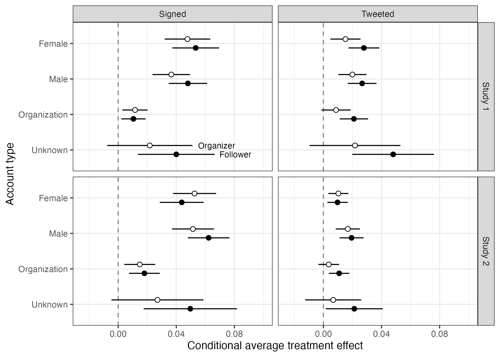

# Active Maintenance Report: coppock_guess_ternovski_2016

2026-08-03

- [Summary](#summary)
  - [Does the deposited archive run?](#does-the-deposited-archive-run)
  - [Does the maintained rewrite reproduce the
    paper?](#does-the-maintained-rewrite-reproduce-the-paper)
- [Paper overview](#paper-overview)
- [Original archive reproducibility](#original-archive-reproducibility)
  - [The stargazer call-length
    failure](#the-stargazer-call-length-failure)
  - [What still works](#what-still-works)
  - [The balance check that could not
    fail](#the-balance-check-that-could-not-fail)
- [Errata](#errata)
- [Number-by-number comparison](#number-by-number-comparison)
- [Maintained rewrite](#maintained-rewrite)
  - [Architecture](#architecture)
  - [Deprecated patterns replaced](#deprecated-patterns-replaced)
- [The omnibus balance tests](#the-omnibus-balance-tests)
- [Figure 3](#figure-3)
- [Maintained rewrite verification](#maintained-rewrite-verification)
- [In-text claims](#in-text-claims)
- [R environment](#r-environment)

This repository holds the actively maintained replication code for
Coppock, Guess and Ternovski (2016), together with the reproducibility
report that documents what the original archive did and did not do. It
is part of a program applying the maintenance proposal in Peer, Orr and
Coppock (2021, *PS: Political Science & Politics*, doi
[10.1017/S1049096521000366](https://doi.org/10.1017/S1049096521000366))
to a set of published archives.

*Drafted by Claude Opus 5 under the supervision of Alex Coppock.*

|  |  |
|----|----|
| Article | [10.1007/s11109-015-9308-6](https://doi.org/10.1007/s11109-015-9308-6) |
| Replication archive | [10.7910/DVN/29548](https://doi.org/10.7910/DVN/29548) |
| Pre-analysis plan | None |

**The data are not redistributed here.** The deposit is 797 KB across 6
files and lives at Harvard Dataverse, which is the only copy this
repository points at. `download_original.R` fetches it and verifies
every file against the checksum and byte size recorded in
`original_manifest.csv`, and stops if `original/` holds anything the
manifest does not list. The exact bytes this code was written against
are therefore pinned in version control even though the bytes themselves
are not. Checksums are quoted only from the manifest: a file this
pipeline writes, such as a figure PDF, records the time it was written
and hashes differently on every run.

**Repository layout.** `maintained/` is the maintained rewrite: one
script per published table or figure, writing to `output/`, which is
committed so a reader can compare a fresh run against it without
downloading anything. `ground_truth/` ties every published number to the
code that produces it. `published_claims.csv` is the extraction: every
numeric token in the article and its appendix, read off the pages and
classified by hand. `extract_archive_values.R` runs the deposited
archive in a scratch copy and records what it produces.
`build_ground_truth.R` joins the two together with the rewrite’s output.
`maintained/in_text_claims.R` reaches the same numbers by a second,
independent path and prints each one beside the sentence it comes from.
`original/` is created by the download script and is deliberately absent
from the repository. This file is the reproducibility report, also
available as a PDF in `report/`.

**License.** CC0 1.0 Universal, matching the terms of the deposit this
repository maintains. See `LICENSE`.

**To reproduce.** Clone or download the repository, open
`coppock_guess_ternovski_2016.Rproj`, and run:

``` r
source("run_all.R")
```

That fetches the deposit, verifies its 6 files, and produces every table
and figure into `maintained/output/`. Required packages for the rewrite:
tidyverse, estimatr, randomizr, nnet, modelsummary, knitr, kableExtra
and here. Running the deposited archive needs AER, stargazer, xtable,
lmtest and sandwich in addition, which
`ground_truth/extract_archive_values.R` does in a scratch directory: set
`ARCHIVE_RUN_DIR` to choose where, or leave it and the script uses a
folder inside `tempdir()`. The deposit is never run in place, because
running it writes files. Paths resolve through `here`, so nothing
depends on the working directory. Most of the runtime is six
randomization inference tests, each permuting assignment 1,000 times and
refitting a pair of multinomial logits on every draw; every other script
takes seconds. A successful run overwrites `maintained/output/`, which
is committed: **`git diff` on that folder is the reproduction check**,
and a clean run leaves only the figure PDFs changed.

# Summary

Two questions, answered before the detail.

## Does the deposited archive run?

No. Both analysis scripts stop with an error partway through.
`LCV Experiments 1 and 2 analysis.R` dies at the Table 6 `stargazer()`
call, taking Tables 7, 8, 9 and Figure 3 with it.
`LCV Appendix analysis.R` dies earlier still, at the Study 1 omnibus
balance test, because `complete_ra()` no longer accepts the argument
`condition_names`; the current argument is `conditions`. Repair that and
the appendix script dies at the Table A4 `stargazer()` call in turn, and
one of its `print.xtable()` calls writes to a personal directory path
that exists on no other machine.

Patch those three faults and everything computes, but one published
number does not come back. The Study 1 omnibus balance p-value is 0.607
in the appendix and 0.579 here. It is a randomization inference p-value
drawn with `set.seed(343)` over 1,000 permutations from `complete_ra()`,
and the archive’s own comments install randomizr from GitHub rather than
from CRAN, pinned to nothing, so the random number stream that produced
0.607 belongs to a state of that repository a reader cannot now obtain.
The Study 2 omnibus p-value has the same shape but a happier ending:
0.113 in the appendix, 0.117 under a current R, and 0.113 under
`RNGkind(sample.kind = "Rounding")`. That one is the R 3.6 sampler
change and nothing else, because Study 2’s permutation function is
written out by hand in the deposit instead of coming from a package.

## Does the maintained rewrite reproduce the paper?

Yes, with 4 exceptions out of 682 published values, and none of them
touches a result.

Two are the omnibus balance p-values, which are simulation output and
are reported as such: 0.579 against a published 0.607 for Study 1, and
0.108 against a published 0.113 for Study 2, both far from any threshold
and both within the Monte Carlo error of a 1,000-draw permutation test.
The third is a count: the article says the 221 Study 2 petition signers
“were followed by 1990 other users”, and the deposited data hold 1991
subjects with a positive probability of exposure, of whom the 1975 whose
probability is strictly below one are the sample Table 9 analyses. The
fourth is the appendix’s statement that subject types 5 through 7 make
up “approximately 4.5%” of the Study 2 population, where the signing
rate among direct message subjects is 4.41%.

Everything else matches to the precision the article prints: all of
Tables 2 through 9, both balance tables, both heterogeneity tables, the
account type shares in the Figure 3 caption, and every quantity the
results sections state in running text as a number rather than as an
inequality.

# Paper overview

**Citation**: Coppock, A., Guess, A. and Ternovski, J. (2016). “When
treatments are tweets: A network mobilization experiment over Twitter.”
*Political Behavior*, 38(1), 105-128. DOI: 10.1007/s11109-015-9308-6

**Summary**: Two field experiments run with the League of Conservation
Voters test whether direct appeals over Twitter mobilize participation,
and whether that mobilization spreads through the network. In each study
LCV posted a public tweet asking supporters to sign an online petition,
and subjects were randomly assigned to receive, in addition, a direct
message addressing them as a “follower”, a direct message addressing
them as an “organizer”, or nothing beyond the public tweet. Petition
signers were then randomly shown a tweet button encouraging them to pass
the link on, which randomly exposed the subjects’ own followers to
additional tweets and makes the second stage an experiment in its own
right, analysed with inverse probability of exposure weights and
instrumental variables. Study 1 (N = 6,687) ran in February 2014, Study
2 (N = 8,507) in July 2014. A direct message of either kind raised the
signature rate by 3.6 percentage points in Study 1 and 4.4 in Study 2
while the public tweet moved nothing at all, and in Study 2 exposure to
a signer’s tweet raised signing among compliers by 5.6 percentage
points.

# Original archive reproducibility

| Script | Top-level expressions | Error that stops source() | Expressions still failing when repaired and run one at a time |
|:---|---:|:---|:---|
| LCV Experiments 1 and 2 analysis.R | 55 | the condition has length \> 1 | 2 (lines 142, 188) |
| LCV Appendix analysis.R | 78 | unused argument (condition_names = c(“pub”, “fol”, “org”)) | 2 (lines 206, 241) |

The deposited archive on R 4.6.0. LCVsource.r is not listed: it defines
functions, is sourced by both scripts, and needs no changes.

Every package the archive names still installs from CRAN: `stargazer`,
`AER`, `ggplot2`, `dplyr`, `nnet`, `xtable` and `randomizr`, along with
the `lmtest` and `sandwich` that `LCVsource.r` calls for by hand. The
exposure is not availability but maintenance. The installed `stargazer`
is version 5.2.3, dated 2022-03-03, and it carries the call-parsing
defect described below. `randomizr` is under active development, and the
argument the archive passes to `complete_ra()` is not one the installed
version 1.0.1 accepts.

Running the two scripts expression by expression, so that one failure
does not hide the next, separates the faults cleanly. Of the 8
`stargazer()` calls across the two files, 4 fail: the two exposure
tables of the main text, which are Tables 6 and 9, and both of the
appendix’s heterogeneity tables, A4 and A5. The 4 that succeed deparse
to a shorter call. Every other expression in the main script runs,
including the whole Figure 3 block, which assembles all 32 plotted
estimates and writes its PNG as intended. The appendix script adds two
faults of its own, the `condition_names` argument and the hardcoded
`print.xtable()` path. Run as shipped, the first of those also takes
down the `hist()` and `abline()` calls that follow it, because the
vector they plot was never filled; both edits together are what leaves
only the two `stargazer()` failures in the table above.

## The stargazer call-length failure

The error is `the condition has length > 1`, raised inside `stargazer`’s
own `.get.object.names`. What decides it is neither the models nor the
arguments:

``` r
short <- aaaaaaaaaaaaaaaaaaaaaaaa.1
stargazer(short, type = "text")                                           # fine
stargazer(aaaaaaaaaaaaaaaaaaaaaaaa.1, aaaaaaaaaaaaaaaaaaaaaaaa.1,
          type = "text")                                                  # fine
stargazer(aaaaaaaaaaaaaaaaaaaaaaaa.1, aaaaaaaaaaaaaaaaaaaaaaaa.1,
          aaaaaaaaaaaaaaaaaaaaaaaa.1, type = "text")                      # error
```

All three tabulate the same model, and the name is 26 characters long.
`stargazer` deparses the call it was given in order to label the
columns, and `deparse()` breaks its result into several strings once the
text is long enough. The package then tests that vector with
`if (is.na(s))`, which was a warning before R 4.2 and has been an error
since. Any archive that names its model objects descriptively and
tabulates several of them at once is exposed, which is a large class of
archives. The maintained rewrite tabulates with `modelsummary` and does
not inherit the problem.

## What still works

`prepareforgg()`, the Figure 3 helper, chains two `dplyr::do()` calls
and takes the coefficients out of the second with `.$mod`. Both `do()`
and that idiom are superseded, and the rewrite replaces them, but
neither is broken: on dplyr 1.2.1 the chain runs and returns the correct
eight rows per call. The reason Figure 3 never appears in a batch run is
that the file stops at the third of its six `stargazer()` calls, well
before the figure block and in a part of the script that has nothing to
do with the figure.

## The balance check that could not fail

The article reports an anomaly in Study 1: assignment to the tweet
encouragement predicted petition signing at `p < .01`, which should have
been impossible, since the encouragement was displayed only after a
subject had signed. The deposit fits that regression with `lm()` and
gets 0.0047; the rewrite fits it with HC2 errors and gets 0.0092. Both
are below the threshold the article names, so the anomaly it reports is
in the data rather than in the reporting of it.

The deposit runs the same check on Study 2 and its comment records no
imbalance. That check cannot detect one. In Study 2 the encouragement
was assigned inside the survey software after a subject clicked through,
so `tweetbutton` is recorded only for the 221 petition signers, and
within them the signing outcome is constant at one. The regression
therefore has no outcome variation to explain, and it would return the
same verdict whatever the data held. The design change is what rules out
a Study 2 imbalance, not the regression.

# Errata

One published label is wrong, and the deposit shows how. Table A3
reports a Study 2 covariate as “Number of Tweets” with arm means of
1559.503, 1554.428, 1552.586. The line that produces those numbers is
`mean_days = mean(days_on_twitter, na.rm = TRUE)`, and the row label
comes from a separate hand-written vector that says “Number of Tweets”
where Table A2’s equivalent says “Days on Twitter”. The rewrite takes
the mean of `days_on_twitter` within each arm and gets 1559.503,
1554.428, 1552.586, the same three numbers to every printed decimal. The
row is days on Twitter, the values are right, and the label is a slip.
The maintained rewrite labels it “Days on Twitter” and the ground truth
records the values as matching.

The archive’s `strata_ra()` helper carries a second slip with no
consequence: it writes `"ord"` where it means `"org"` when labelling the
third arm of a simulated assignment. Since the labels only feed a
multinomial logit whose deviance does not depend on them, the Study 2
omnibus p-value is unaffected. The rewrite permutes with
`randomizr::block_ra()` instead, which draws the same block-by-block arm
sizes.

# Number-by-number comparison

What gets checked is fixed in advance, by an extraction rather than by
what the pipeline happens to produce.
`ground_truth/published_claims.csv` lists every numeric token in the
article and its online appendix, read off the pages and classified by
hand into 4 kinds: 705 are pipeline quantities, 20 are claims about a
shape, a sign or a threshold rather than a value, and 13 are
definitional or structural constants that no analysis can move. Every
pipeline and descriptive claim must have both a row in the ground truth
and a block in `maintained/in_text_claims.R`, and the build stops if
either is missing.

The ground truth then pairs each published claim with two independently
produced values: `value_script`, read out of the models the deposited
code fits when it is run in a scratch copy of the archive, and
`value_rewrite`, read out of `maintained/output/`. A published value
enters only from the extraction, never from a script run, and the
verdicts are computed by comparing the two against the string the
article prints, at the precision it prints. A qualitative claim carries
the same machinery with a truth value in place of a number, so an
article contradicting its own estimates registers as a mismatch like any
other. The complete table is
`ground_truth/coppock_guess_ternovski_2016_ground_truth.csv`; the
summary and every non-matching row are below.

| Published float | Rows | Archive matches | Rewrite matches |
|:---|---:|:---|:---|
| Table 1: organizations’ Twitter accounts | 4 | 0 / 0 | 0 / 0 |
| Table 2: Study 1 design and outcomes | 30 | 30 / 30 | 30 / 30 |
| Table 3: Study 2 design and outcomes | 35 | 35 / 35 | 35 / 35 |
| Table 4: Study 1 direct message effects | 60 | 60 / 60 | 60 / 60 |
| Table 5: Study 1 tweet encouragement | 16 | 16 / 16 | 16 / 16 |
| Table 6: Study 1 network effects | 30 | 30 / 30 | 30 / 30 |
| Table 7: Study 2 direct message effects | 60 | 60 / 60 | 59 / 59 |
| Table 8: Study 2 tweet encouragement | 16 | 16 / 16 | 16 / 16 |
| Table 9: Study 2 network effects | 30 | 30 / 30 | 30 / 30 |
| Figure 1: Study 1 follower network | 8 | 1 / 1 | 1 / 1 |
| Figure 2: LCV tweets per weekday | 2 | 0 / 0 | 0 / 0 |
| Figure 3: effects by account type | 13 | 12 / 12 | 12 / 12 |
| Table A1: possible subject types | 5 | 2 / 3 | 2 / 3 |
| Table A2: Study 1 balance | 51 | 49 / 51 | 49 / 50 |
| Table A3: Study 2 balance | 51 | 50 / 51 | 49 / 50 |
| Table A4: Study 1 heterogeneity | 136 | 136 / 136 | 126 / 126 |
| Table A5: Study 2 heterogeneity | 136 | 136 / 136 | 125 / 125 |
| Figures A1 to A6: screenshots | 1 | 0 / 0 | 0 / 0 |
| Running text | 57 | 38 / 39 | 38 / 39 |

Ground truth coverage, by published float. Matches are counted against
the rows that can be compared at all.

Of the 741 recorded claims, 706 can be compared against a value the
deposited code produces. 701 match and 5 do not. Every published float
in the article and the appendix has a row here, including the ones
nothing in the deposit can reach: the deposit is 2 data files, 3 code
files and 1 README, with no stored results at all, so Table 1, Figure 1
and Figure 2 have no source in it. Those rows are listed as uncovered
with the reason.

| Float | Claim | Paper | Note |
|:---|:---|:---|:---|
| Running text | Study 1: p-value on the tweet encouragement assignment predicting signing |  | The article prints an inequality rather than a value, so there is nothing to compare at printed precision. The deposit’s own lm() gives 0.0047 and the rewrite’s HC2 fit gives 0.0092, both below the 0.01 the article asserts. |
| Table A1: possible subject types | Table A1: type 8 proportion, lower end of the printed interval | 0.955 | The appendix prints an interval derived from rounded inputs. Both computed complements, 0.9559 for Study 2 and 0.9637 for Study 1, fall inside it. |
| Table A1: possible subject types | Table A1: type 8 proportion, upper end of the printed interval | 0.965 | The appendix prints an interval derived from rounded inputs. Both computed complements, 0.9559 for Study 2 and 0.9637 for Study 1, fall inside it. |
| Table 1: organizations’ Twitter accounts | Descriptive statistics of eleven environmental organizations’ Twitter accounts |  | Collected from Twitter profiles in February 2015. The deposit holds only the two experimental data frames, so nothing in it can produce this table. |
| Table 1: organizations’ Twitter accounts | Mean number of followers among the top ten organizations | 118988 | Derived from the printed table; no deposited data behind it. |
| Table 1: organizations’ Twitter accounts | Mean tweets per weekday among the top ten organizations | 13 | Derived from the printed table; no deposited data behind it. |
| Table 1: organizations’ Twitter accounts | Median account creation year among the top ten organizations | 2008 | Derived from the printed table; no deposited data behind it. |
| Figure 1: Study 1 follower network | Communities in the Study 1 follower network under the Walktrap algorithm | 22 | The network edge list is not deposited, so neither the figure nor its community count can be rebuilt. |
| Figure 1: Study 1 follower network | Modularity of the Study 1 follower network | 0.3 | The network edge list is not deposited. |
| Figure 1: Study 1 follower network | Possible connections between nodes in the Study 1 network | 44709282 | The network edge list is not deposited. |
| Figure 1: Study 1 follower network | Observed edges in the Study 1 network | 131474 | The network edge list is not deposited. |
| Figure 1: Study 1 follower network | Graph density of the Study 1 network | 0.0029 | The network edge list is not deposited. |
| Figure 1: Study 1 follower network | Median number of network members a follower follows | 6 | The network edge list is not deposited. |
| Figure 1: Study 1 follower network | Largest out-degree observed in the network | 601 | The network edge list is not deposited. |
| Figure 2: LCV tweets per weekday | LCV tweets and retweets per weekday, February 2013 to February 2015, mean | 6.07 | The daily tweet series is not deposited. |
| Figure 2: LCV tweets per weekday | LCV tweets and retweets per weekday, standard deviation | 10.05 | The daily tweet series is not deposited. |
| Running text | Intercoder reliability of the account type coding, Cohen’s kappa | 0.90 | The coding was done by hand on 200 profiles and only the resolved account type is deposited, so the two coders’ assignments no longer exist. |
| Running text | Study 1: users outside the LCV network who retweeted | 5 | Both data frames hold only LCV followers, so users outside the network are not in the deposit. |
| Running text | Study 2: users outside the LCV network who retweeted | 7 | Both data frames hold only LCV followers, so users outside the network are not in the deposit. |
| Running text | Total followers of the LCV’s followers | 7000000 | Stated as an order of magnitude in the text. The follower-of-follower counts are not deposited. |
| Figures A1 to A6: screenshots | Screenshots of the petitions, the tweet encouragement and the public tweets |  | Six screenshots of experimental materials. No numbers and no data. |
| Figure 3: effects by account type | All 32 plotted conditional effects and their standard errors |  | The figure prints no numbers, so there is nothing to compare against the article. All 32 plotted estimate and standard error pairs agree with the estimates the deposit hands to ggplot to within 7.3e-15. |

Published claims recorded as not comparable, and why.

Where a table’s `stargazer()` call fails, the models behind it still
fit, and the archive values recorded here come from those model objects.
The model objects are the informative comparison, because they separate
a printing failure from an estimation failure, and here the failure is
entirely in the printing.

A further 22 cells are recorded as unverifiable rather than as matches
or mismatches. Each is a standard error on a coefficient identified only
within the public tweet arm, where no subject signed or tweeted, so
every residual there is zero and the robust variance of the term is zero
up to floating point, coming back very slightly negative. The published
tables print `0.000` for all of them, by two different routes: in 11
cells `vcovHC()` returns a tiny positive variance whose square root
rounds to zero, and in the other 11 it returns `NaN` and the deposit’s
own wrapper replaces the `NaN` with `0.00004`. `estimatr::lm_robust()`
takes the square root and returns `NaN`, which is the correct answer for
a variance that is not positive, and the ground truth carries the reason
on each row.

# Maintained rewrite

The rewrite lives in `maintained/`: a shared `helpers.R` and 19 scripts
covering one cleaning step, the eight published tables of the main text,
the four appendix tables that come from data, Figure 3, two scripts for
the quantities the article states only in running text, one that turns
the article’s qualitative claims into truth values, one that prints
every published number beside the sentence it appears in, and one that
re-runs the archive’s own omnibus tests under the sampler R shipped
before 3.6.0. It is a translation, not a reanalysis: every estimator,
specification and sample restriction is the one the paper used.

## Architecture

`clean_lcv.R` reads the two deposited data frames and writes tibbles
with explicit factor levels for treatment and account type, and with the
centred covariates flattened from the one-column matrices `scale()`
leaves behind. Everything downstream reads those two files, so no
analysis script touches `original/` directly.

The archive computes robust standard errors by fitting with `lm()` and
then passing the fit through a
`coeftest(fit, vcovHC(fit, type = "HC2"))` wrapper defined in
`LCVsource.r`. The rewrite calls `estimatr::lm_robust()`, whose default
`se_type` is already HC2, and `iv_robust()` in place of `AER::ivreg()`
with the same wrapper. Those are the same estimators with the same
standard errors.

Two places need care rather than translation. The article reports the
follower against organizer difference by refitting on the two direct
message arms alone; `lm()` silently drops the now-empty `pub` level and
`lm_robust()` does not, so the rewrite calls `droplevels()` and the
reference category comes out where the published table puts it. Figure 3
is the one output where the paper does not use robust standard errors:
its intervals come from `coef(summary(lm(...)))`. The figure script
therefore passes `se_type = "classical"` explicitly, with a comment
saying why, rather than quietly plotting a different interval from the
one the article shows.

## Deprecated patterns replaced

| Original pattern | Replacement |
|:---|:---|
| `rm(list = ls())` | (omitted) |
| `setwd("")` | `here::here()` |
| `lm()` + `coeftest(vcovHC, 'HC2')` | `estimatr::lm_robust()` |
| `AER::ivreg()` + the same wrapper | `estimatr::iv_robust()` |
| `stargazer` (eight calls, four of them fatal) | `modelsummary(output = )` plus a tidy `.csv` |
| `xtable` + `print.xtable` to a hardcoded path | `knitr::kable()` to `output/` |
| chained `do(mod = lm(...))` + `do(data.frame(...))` | `nest()` + `map()` + `unnest()` |
| `complete_ra(condition_names = )` | `complete_ra(conditions = )` |
| hand-written `strata_ra()` | `randomizr::block_ra()` |
| `coord_flip()` + `geom_pointrange` + legend | estimate on `x`, `geom_linerange`, direct labels |
| magrittr pipe | native pipe |

Deprecated patterns and their replacements in the maintained rewrite.

Nothing in `maintained/output/` is typed in. Every value there,
including the two omnibus p-values and the four percentages in the
Figure 3 caption, is computed from the deposited data by the script that
writes it.

# The omnibus balance tests

The appendix reports one omnibus balance p-value per study, each from a
randomization inference procedure: fit a multinomial logit of assignment
on all four covariates, take the likelihood ratio against an
intercept-only fit, then repeat against 1,000 assignments permuted under
the study’s own protocol.

| Study | Published | Archive | Archive, old sampler | Rewrite | Protocol |
|:---|:---|:---|:---|:---|:---|
| Study 1 (Table A2) | 0.607 | 0.579 | 0.586 | 0.579 | complete_ra(), from a 2015 GitHub randomizr |
| Study 2 (Table A3) | 0.113 | 0.117 | 0.113 | 0.108 | strata_ra(), written out in the deposit |

Omnibus balance p-values, 1,000 permutations each. The old sampler
column re-runs the deposit’s own permutation code under
RNGkind(sample.kind = “Rounding”).

Study 2’s number is recoverable and Study 1’s is not, and the difference
is where the permutation comes from. Study 2 permutes with a function
written out inside `LCVsource.r`, so the only thing standing between the
published p-value and a current R is the sampler:
`RNGkind(sample.kind = "Rounding")` returns 0.113 exactly. Study 1
permutes with `complete_ra()`, which the archive’s own comments say to
install with `devtools::install_github("acoppock/randomizr")`. That
names no version, and the released package has since dropped the very
argument the archive passes it, so the draws behind 0.607 cannot be
reconstructed, and the old sampler does not recover them either. The
rewrite keeps the modern sampler in both cases and reports what it gets.
Neither p-value is close to a threshold under any of the four routes
above, so the balance conclusion the appendix draws is unaffected.

# Figure 3

The figure plots conditional average treatment effects of the two direct
message treatments within each account type, for each outcome and each
study. The figure prints no numbers, so there is nothing to compare
against the article. All 32 plotted estimate and standard error pairs
agree with the estimates the deposit hands to ggplot to within 7.3e-15.
What the article does print is the caption, which reports the account
type composition of both samples, and all eight of those percentages
reproduce.

| Quantity                              | Paper | Rewrite | Match |
|:--------------------------------------|:------|:--------|------:|
| Study 1 sample male, percent          | 38.4  | 38.4    |     1 |
| Study 1 sample female, percent        | 30.4  | 30.4    |     1 |
| Study 1 sample organizations, percent | 24.4  | 24.4    |     1 |
| Study 1 sample unknown, percent       | 6.8   | 6.8     |     1 |
| Study 2 sample male, percent          | 39.3  | 39.3    |     1 |
| Study 2 sample female, percent        | 32.9  | 32.9    |     1 |
| Study 2 sample organizations, percent | 22.1  | 22.1    |     1 |
| Study 2 sample unknown, percent       | 5.7   | 5.7     |     1 |

Figure 3 caption: sample composition by account type, in percent.



The rewrite’s version differs from the published figure in presentation
rather than content: the treatment arms are labelled beside the
estimates instead of in a legend, the horizontal layout is built by
mapping the account type to `y` rather than by flipping a vertical plot,
and the interval is the fitted model’s own 95 per cent confidence
interval rather than the estimate plus or minus 1.96 standard errors.

# Maintained rewrite verification

**678** of 682 published values are reproduced to the precision the
article prints. The 4 that are not are listed below with what separates
them, and with where the fault lies.

| Float | Claim | Paper | Rewrite | Fault | Note |
|:---|:---|:---|:---|:---|:---|
| Table A2: Study 1 balance | Omnibus p-value | 0.607 | 0.579 | archive | Randomization inference p-value over 1,000 permutations drawn with complete_ra(). The deposit’s own comments install randomizr from GitHub rather than from CRAN and name no version, and the released package no longer accepts the argument the deposit passes it, so the stream behind the published value cannot be reconstructed, and the old sampler does not recover it either. |
| Table A3: Study 2 balance | Omnibus p-value | 0.113 | 0.108 | environment | Randomization inference p-value over 1,000 permutations. The deposit’s own strata_ra() reproduces the published value exactly under RNGkind(sample.kind = ‘Rounding’); both figures here use the sampler R has shipped since 3.6.0. |
| Running text | Study 2: subjects of the second-stage experiment | 1990 | 1991 | paper_internal | The deposited data hold 1991 Study 2 subjects with a positive probability of exposure, of whom the 1975 whose probability is strictly below one are the sample Table 9 analyses. |
| Table A1: possible subject types | Table A1: types 5 to 7 combined, Study 2, percent of population | 4.5 | 4.409 | paper_internal | The signing rate among Study 2 direct message subjects is 4.41 percent, which the appendix rounds up. |

Published values the maintained rewrite does not reproduce.

2 of the 4 sit in the article rather than in any code. The published
follower count and the published subject type share are both stated in
the text, and both disagree with the deposited data by a rounding or a
transcription; the rewrite reports what the data hold. The Study 1
omnibus p-value is unrecoverable from the deposit for the reason given
above, and the Study 2 one moves with the sampler that R shipped in
3.6.0, which is a property of the environment rather than a defect in
either the archive or the rewrite.

# In-text claims

Numbers stated in running prose are where a paper drifts from its own
analysis, and a coverage check built around floats cannot see them.
`maintained/in_text_claims.R` prints every published quantity beside the
sentence it appears in, in the article’s own units and to the article’s
own precision, section by section in reading order. It reads the same
files in `maintained/output/` that the ground truth reads, and does its
own filtering, unit conversion and rounding: two paths from one set of
estimates to one claimed number, so a disagreement between them is a
finding rather than a formality. It fits nothing, and 46 blocks between
them cover every pipeline and descriptive claim in the extraction.

The 20 qualitative claims are handled separately, because they assert a
shape rather than a value. Each is turned into a statement about the
estimates and evaluated: that the organization conditional effects are
the smallest of the four account types, that the follower prime is more
than twice as effective as the organizer prime, that no subject in
either public tweet arm signed or retweeted. 20 of 20 hold, and each
carries the numbers behind the verdict in
`maintained/output/text_descriptive_claims.csv`.

| Claim | Holds | Evidence |
|:---|:---|:---|
| d_encouragement_one_third | yes | Share shown the encouragement within each Study 1 direct message arm: 0.3333, 0.3333. |
| d_study1_pub_zero_signed | yes | Study 1 public tweet arm: 0 signatures among 3687 subjects. |
| d_study1_dm_significant | yes | Study 1 signing: follower 0.039 (p = 5.5e-15), organizer 0.033 (p = 7.2e-13); both positive and both below 0.01. |
| d_study1_encouragement_half | yes | Study 1 encouragement effect on tweeting among signers: 0.454, read as nearly half. |
| d_study1_organizer_38pp | yes | Encouragement by organizer interaction, Study 1: -0.384, that is 38.4 percentage points. |
| d_study1_follower_twice | yes | Study 1 encouragement effect: 62.4 percentage points in the follower arm against 24.0 in the organizer arm, a ratio of 2.60. |
| d_study1_network_null | yes | Study 1 second stage, columns 2 to 5, p-values: 0.46, 0.46, 0.73, 0.73. |
| d_study2_larger | yes | Signing effects: follower 0.039 in Study 1 against 0.046 in Study 2; organizer 0.033 against 0.043. |
| d_study2_follower_more_effective | yes | Study 2 tweeting: follower 0.014 against organizer 0.011, difference p = 0.3. |
| d_study2_tweeted_network_null | yes | Study 2 second stage, tweeting, columns 4 and 5, p-values: 0.18, 0.19. |
| d_study2_network_larger_than_main | yes | Study 2 complier effect on signing 0.056 against direct message effects of 0.046 and 0.043. |
| d_public_tweet_null | yes | Public tweet arms: Study 1 0 signed and 0 tweeted of 3687; Study 2 0 signed and 0 tweeted of 3495. |
| d_dm_click_4pp | yes | Effect of any direct message on signing: 3.6 percentage points in Study 1 and 4.4 in Study 2, both rounding to 4. |
| d_dm_signatures_exceed_tweets | yes | Study 1: signing 3.6 against tweeting 2.2 percentage points. Study 2: 4.4 against 1.3. |
| d_button_35_to_45 | yes | Tweet encouragement effect on tweeting among signers: 35.0 percentage points in Study 2 and 45.4 in Study 1, a range of 35 to 45 at the precision the article prints. |
| d_study1_org_smaller_signed | yes | Study 1 signing: the organization conditional effect is the smallest of the four account types for both treatments, by -0.037 and -0.024 against the mean of the others. |
| d_study1_no_het_tweeted | yes | Study 1 tweeting, treatment by account type interactions, p-values: 0.91, 0.56, 0.53, 0.39, 0.33, 0.69. |
| d_study2_org_smaller_signed | yes | Study 2 signing: the organization conditional effect is the smallest of the four account types for both treatments, by -0.034 and -0.029. Study 2 tweeting interactions, p-values: 0.083, 0.23, 0.84, 0.13, 0.36, 0.64. |
| d_no_gender_pattern | yes | Male minus female conditional effects across the 8 study by outcome by treatment cells: 4 positive and 4 negative. |
| d_types_1_to_4_zero | yes | Signatures in the public tweet arms: 0 in Study 1 and 0 in Study 2. |

The article’s qualitative claims, evaluated against the estimates the
maintained rewrite produces.

# R environment

| Item      | Value                  |
|:----------|:-----------------------|
| R version | 4.6.0                  |
| Platform  | aarch64-apple-darwin23 |
| Date run  | 2026-08-03             |

| Package      | Version |
|:-------------|:--------|
| estimatr     | 1.0.6   |
| randomizr    | 1.0.1   |
| nnet         | 7.3.20  |
| modelsummary | 2.6.0   |
| AER          | 1.2.17  |
| dplyr        | 1.2.1   |
| ggplot2      | 4.0.3   |
| tidyr        | 1.3.2   |
| purrr        | 1.2.2   |
| here         | 1.0.2   |

Package versions used for the run behind this report.
